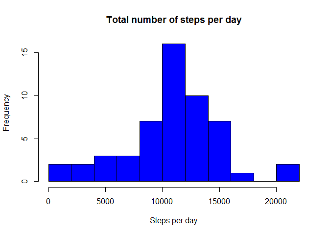
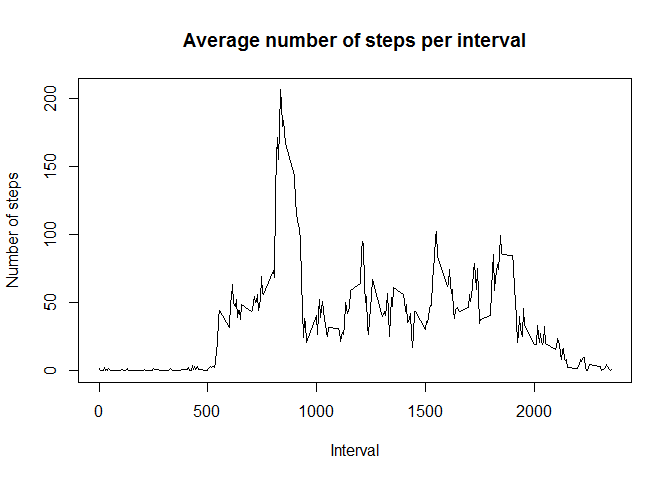
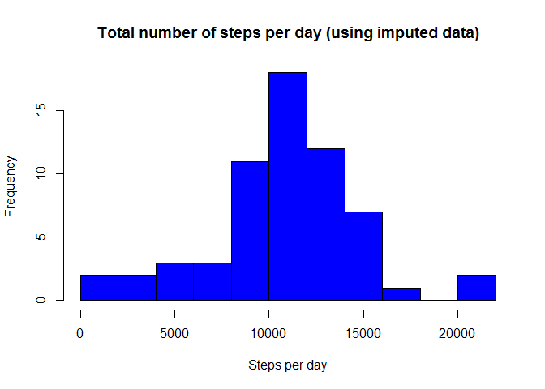
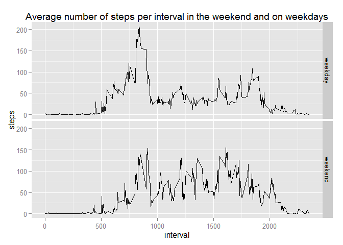

# Reproducible Research: Peer Assessment 1

Before doing anything, setting the locale, otherwise weekdays will be in Dutch.

```r
Sys.setlocale("LC_TIME", "English")
```

```
## [1] "English_United States.1252"
```

## Loading and preprocessing the data

Make sure that the workspace is the same folder as where the data is. The data is loaded with

```r
activity <- read.csv("activity.csv")
```

This gives data frame with 17568 observations of 3 variables:

```r
str(activity)
```

```
## 'data.frame':	17568 obs. of  3 variables:
##  $ steps   : int  NA NA NA NA NA NA NA NA NA NA ...
##  $ date    : Factor w/ 61 levels "2012-10-01","2012-10-02",..: 1 1 1 1 1 1 1 1 1 1 ...
##  $ interval: int  0 5 10 15 20 25 30 35 40 45 ...
```

As the dates are available as factors, they are first transformed into dates.


```r
activity$date <- as.Date(activity$date)
str(activity)
```

```
## 'data.frame':	17568 obs. of  3 variables:
##  $ steps   : int  NA NA NA NA NA NA NA NA NA NA ...
##  $ date    : Date, format: "2012-10-01" "2012-10-01" ...
##  $ interval: int  0 5 10 15 20 25 30 35 40 45 ...
```

## What is mean total number of steps taken per day?
We are interested in the daily activities of this individuals, so we are grouping the data per day. For this I use the dplyr library. After grouping, the total number of steps per day is computed.

```r
library(dplyr)
```


```r
activityDay <- activity %>% group_by(date) %>% summarise_each(funs(sum))
activityDay <- activityDay[,1:2]
activityDay
```

```
## Source: local data frame [61 x 2]
## 
##          date steps
## 1  2012-10-01    NA
## 2  2012-10-02   126
## 3  2012-10-03 11352
## 4  2012-10-04 12116
## 5  2012-10-05 13294
## 6  2012-10-06 15420
## 7  2012-10-07 11015
## 8  2012-10-08    NA
## 9  2012-10-09 12811
## 10 2012-10-10  9900
## ..        ...   ...
```

Now make a histogram of the total numnber of steps per day. To get a little more details, I use 10 separate bins.

```r
hist(activityDay$steps, breaks=10,  main="Total number of steps per day", xlab="Steps per day",
     col="blue")
```

 

And I want to know the mean and the median of the number of stepts taken per day. As there are intervals and even days, where this individual does not take a step (or doesn't use his/her tracking device), I don't want to use the NA values.

```r
meanSteps <- format(mean(activityDay$steps,na.rm=T), scientific=F)
medianSteps <- median(activityDay$steps,na.rm=T)
```
The mean steps per day is 10766.19.  
The median steps per day is 10765

## What is the average daily activity pattern?
Let's make a time series plot of the 5-minute intervals. For this, we use the average number of steps in this interval of all the days.  

We therefor first need to regroup the data and compute mean values.

```r
activityInterval <- activity %>% group_by(interval)  %>% summarise_each(funs(mean(., na.rm=T)))
activityInterval <- activityInterval[1:2]
activityInterval
```

```
## Source: local data frame [288 x 2]
## 
##    interval     steps
## 1         0 1.7169811
## 2         5 0.3396226
## 3        10 0.1320755
## 4        15 0.1509434
## 5        20 0.0754717
## 6        25 2.0943396
## 7        30 0.5283019
## 8        35 0.8679245
## 9        40 0.0000000
## 10       45 1.4716981
## ..      ...       ...
```

From this result we make a plot.

```r
plot(activityInterval$interval,activityInterval$steps,type="l", xlab='Interval',
     ylab="Number of steps", main="Average number of steps per interval")
```

 

Then compute which interval on average has the largerst number of steps.

```r
maxInt <- activityInterval$interval[which.max(activityInterval$steps)]
```
The interval with on average the largest number of steps is 835. So that is between 8:35 and 8:40 a.m.

## Imputing missing values
Some of the intervals do not have no numbers. Lets first find out how many rows have NA values

```r
NumNA <- sum(is.na(activity$steps))
```
There are 2304 intervals that have a NA value.

Although we are allowed to impute easy, I would like to try a sophisticated way by using the mice package. This stand for "Multivariate Imputation by Chained Equations" and computes imputed values based on th input.

```r
library(mice)
```
And now imputing the data.

```r
set.seed(144) # setting the seed, so that every time I run it, I will get the same results
simple <- activity[c("steps","interval")] # removing the date, to make it easier
imputed <- complete(mice(simple))
```
From this, rebuilding the complete data set.

```r
activityComp <- activity
activityComp$steps <- imputed$steps
```
To be sure there are no NA values left, let's take a look at the summary

```r
summary(activityComp)
```

```
##      steps             date               interval     
##  Min.   :  0.00   Min.   :2012-10-01   Min.   :   0.0  
##  1st Qu.:  0.00   1st Qu.:2012-10-16   1st Qu.: 588.8  
##  Median :  0.00   Median :2012-10-31   Median :1177.5  
##  Mean   : 37.37   Mean   :2012-10-31   Mean   :1177.5  
##  3rd Qu.: 13.00   3rd Qu.:2012-11-15   3rd Qu.:1766.2  
##  Max.   :806.00   Max.   :2012-11-30   Max.   :2355.0
```

Now we do the same as we did on the start: compute the total number of steps a day, make a histogram and compute the mean and median total number of steps per day.

```r
activityDayImp <- activityComp %>% group_by(date) %>% summarise_each(funs(sum))
activityDayImp <- activityDayImp[,1:2]
hist(activityDayImp$steps, breaks=10, xlab="Steps per day",     col="blue",
     main="Total number of steps per day (using imputed data)" )
```

 

```r
meanStepsImp <- format(mean(activityDayImp$steps), scientific=F)
medianStepsImp <- median(activityDayImp$steps)
```
The mean steps per day is 10761.69, before imputing data it was 10766.19.  
The median steps per day is 10600, before imputing data it was 10765.  
As can be seen from these values, the impact of imputing values is reasonably low.

## Are there differences in activity patterns between weekdays and weekends?
To do this analysis, we need to decide what are weekdays and weekends. Saturdays and Sundays belong to the weekend, the other five days are weekdays.

```r
activityComp$wd <- weekdays(activityComp$date)
activityComp$dayType <- "weekday"
weekend <- which(activityComp$wd == "Sunday" | activityComp$wd == "Saturday") 
activityComp$dayType[weekend] <- "weekend"
activityComp <- activityComp[-4]# dropping variable 'wd'
```

Now it's time to make a panelplot of the difference between weekdays and weekend. First group the data again and compute the average number of steps per time interval.

```r
actIntImp <- activityComp %>% group_by(interval,dayType)  %>% summarise_each(funs(mean(., na.rm=T)))
```

And then the plot, done with the ggplot2 package

```r
library(ggplot2)
qplot(interval,steps,data=actIntImp, facets=dayType~. , geom=c("line"), main="Average number of steps per interval in the weekend and on weekdays")
```

 
